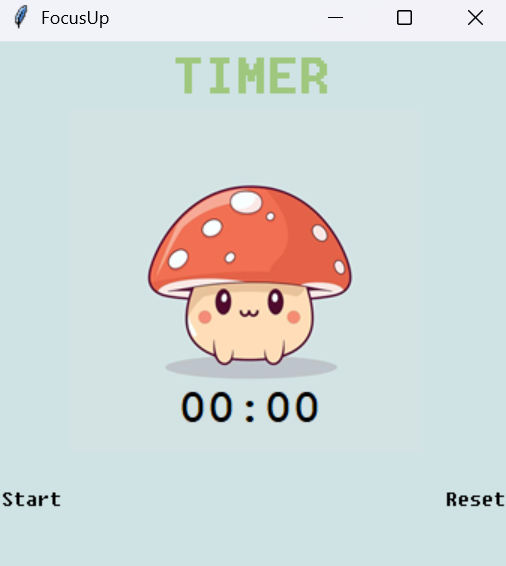

# FocusUp
> *Time your focus. Level it up.*

**FocusUp** is a visually charming and minimal Pomodoro timer application created using Python and Tkinter.  
Inspired by the Pomodoro Technique, the app helps you stay productive by alternating focused work sessions with short breaks — all in a soft pastel-themed interface with custom visuals and gentle sound alerts.

---

## 🎯 Features
- ⏲️ 25-minute work sessions
- 🍵 5-minute short breaks
- 💤 20-minute long breaks after every 4 sessions
- ✅ Checkmarks to track completed work sessions
- 🖼️ Custom background image
- 🔊 Beep sound alert at the end of each session
- 🐍 No external libraries — fully built with Python’s standard library

---

## 🖼️ Screenshot

  
*Your workspace, reimagined with charm and focus.*

---

## 🚀 How to Run

1. Clone this repository:
   ```bash
   git clone https://github.com/your-username/focusup.git
   cd focusup
   ``` 
2. Run the app:
   ```bash
   python main.py
   ```
   
## 📁 Requirements
1. Python 3.x

2. Windows OS (for winsound support)

3. Tkinter (comes pre-installed with Python)

## 📝 Notes
1. Make sure the background image BG_cute.png is placed inside the assets/ folder.

2. This app was designed to run on Windows. For macOS/Linux, you may need to modify or remove the winsound beep part.


## 👩‍💻 Author
Srishti Srivastava

